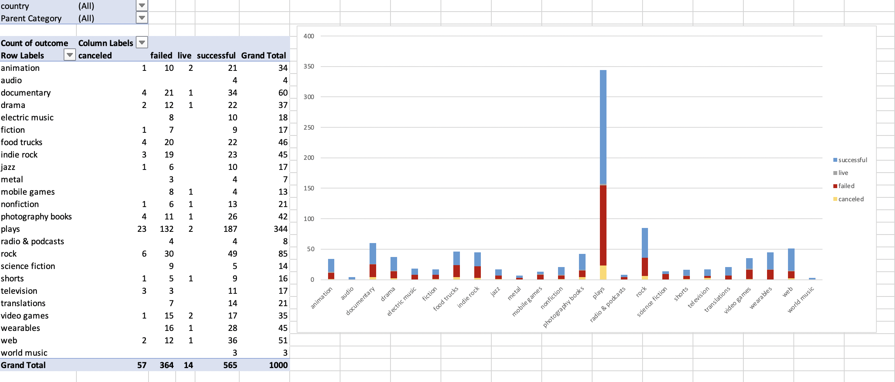

# Excel-Challenge

Crowdfunding platforms like Kickstarter and Indiegogo have been growing in success and popularity since the late 2000s. From independent content creators to famous celebrities, more and more people are using crowdfunding to launch new products and generate buzz, but not every project has found success.

To receive funding, the project must meet or exceed an initial goal, so many organizations dedicate considerable resources looking through old projects in an attempt to discover “the trick” to finding success. This assignment will organize and analyze a database of 1,000 sample projects to uncover any hidden trends.

Functions for this excel assignment are based on the Gitlab class activities given by the Data Analysis Bootcamp, and from general google searches.

# Colour sort successful and failed projects

# Date Conversion

# Pivot Tables & Analysis

